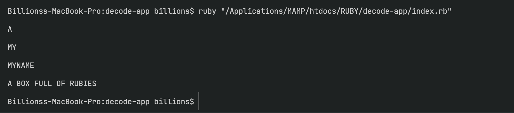

# Decode a Morse code message app

## App screenshot

## Built With

- Ruby

## Author

👤 **Atugonza Joel**

- GitHub: [@billionsjoel](https://github.com/billionsjoel)
- LinkedIn: [billionsjoel](https://www.linkedin.com/in/billionsjoel/)

## 🤝 Contributing

Contributions, issues, and feature requests are welcome!

Feel free to check the [issues page](https://github.com/billionsjoel/decode-app/issues).

## Show your support

Give a ⭐️ if you like this project!

## Acknowledgments

- Coding partner, Standup and morning session team